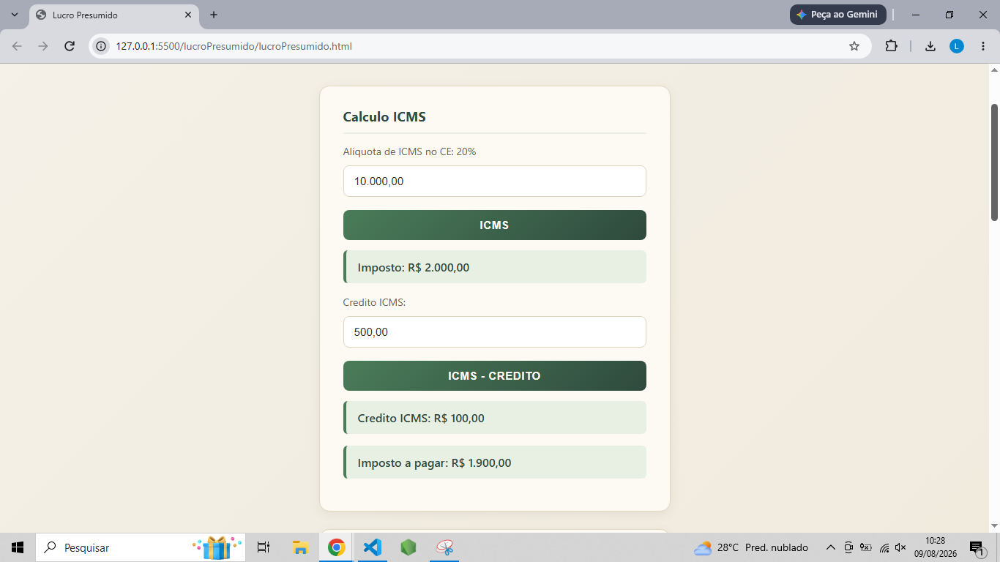

# 🧮 Calculadora de Imposto - Lucro Presumido

Aplicação web simples para simulação e cálculo de impostos no regime tributário de **Lucro Presumido**, desenvolvida com HTML, CSS e JavaScript puro.

## 📋 Sobre o projeto

Este projeto foi criado com o objetivo de aplicar, na prática, conceitos de lógica de programação e desenvolvimento web, unindo minha experiência profissional como Analista Fiscal à minha transição para a área de desenvolvimento de software.

A calculadora simula a apuração de tributos com base no regime de Lucro Presumido, permitindo ao usuário inserir a receita bruta e o tipo de atividade da empresa para obter uma estimativa dos tributos devidos.

## ⚙️ Funcionalidades

- Cálculo de IRPJ com base no percentual de presunção conforme atividade
- Cálculo de CSLL sobre a base presumida
- Cálculo de PIS e COFINS (regime cumulativo)
- Cálculo de ICMS e ISS com base no valor a ser tributado
- Seleção do tipo de atividade (comércio, serviços)
- Interface simples e intuitiva para inserção de dados
- Exibição do resultado detalhado por tributo

## 🖥️ Como usar  

1. Clone o repositório:
```bash
git clone https://github.com/lbarbosa04/calculadoraDeImpostos.git
```

2. Acesse a pasta do projeto:
```bash
cd lucroPresumido
```

3. Abra o arquivo `index.html` no navegador de sua preferência.

Não é necessário instalar nenhuma dependência — o projeto roda 100% no navegador.

## 🛠️ Tecnologias utilizadas

- **HTML5** — estrutura da página
- **CSS3** — estilização e layout
- **JavaScript** — lógica de cálculo dos tributos

## 📸 Demonstração



## 📚 Contexto tributário

O Lucro Presumido é um regime de tributação simplificado, no qual a base de cálculo dos impostos é definida por meio de um percentual de presunção de lucro aplicado sobre a receita bruta, que varia conforme a atividade exercida pela empresa. É uma opção comum para empresas de médio porte que não são obrigadas a apurar pelo Lucro Real.

> ⚠️ Este projeto tem fins educacionais e de portfólio. Os cálculos são simplificados e não substituem uma apuração fiscal profissional.

## 🚀 Próximas melhorias

- [ ] Adicionar mais opções de atividades e percentuais de presunção
- [ ] Incluir responsividade para dispositivos móveis
- [ ] Adicionar histórico de cálculos realizados
- [ ] Exportar resultado em PDF

## 👤 Autor

**Lucas Barbosa**  
Analista Fiscal em transição para Desenvolvimento de Software  
[LinkedIn](https://www.linkedin.com/in/lucas-barbosa-177a112a9?utm_source=share_via&utm_content=profile&utm_medium=member_android)

## 📄 Licença

Este projeto está sob a licença MIT. Sinta-se livre para utilizá-lo.