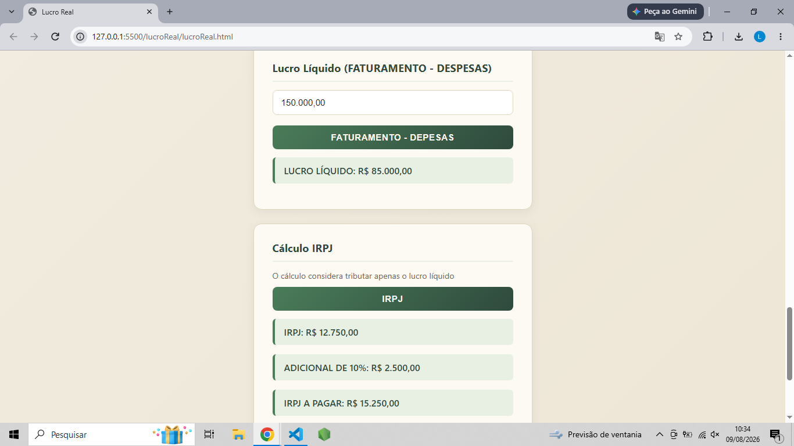

# 🧮 Calculadora de Imposto - Lucro Real

Aplicação web simples para simulação e cálculo de impostos no regime tributário de **Lucro Real**, desenvolvida com HTML, CSS e JavaScript puro.

## 📋 Sobre o projeto

Este projeto foi criado com o objetivo de aplicar, na prática, conceitos de lógica de programação e desenvolvimento web, unindo minha experiência profissional como Analista Fiscal à minha transição para a área de desenvolvimento de software.

A calculadora simula a apuração de tributos com base no regime de Lucro Real, permitindo ao usuário inserir os dados financeiros necessários e visualizar o resultado do cálculo de forma rápida e clara.

## ⚙️ Funcionalidades

- Cálculo de IRPJ (Imposto de Renda Pessoa Jurídica) sobre o lucro real apurado
- Cálculo de CSLL (Contribuição Social sobre o Lucro Líquido)
- Cálculo de PIS e COFINS (regime não cumulativo)
- Cáluclo de ICMS e ISS com base no valor a ser tributado
- Interface simples e intuitiva para inserção de dados
- Exibição do resultado detalhado por tributo

## 🖥️ Como usar

1. Clone o repositório:
```bash
git clone https://github.com/lbarbosa04/calculadoraDeImpostos.git
```

2. Acesse a pasta do projeto:
```bash
cd lucroReal
```

3. Abra o arquivo `index.html` no navegador de sua preferência.

Não é necessário instalar nenhuma dependência — o projeto roda 100% no navegador.

## 🛠️ Tecnologias utilizadas

- **HTML5** — estrutura da página
- **CSS3** — estilização e layout
- **JavaScript** — lógica de cálculo dos tributos

## 📸 Demonstração



## 📚 Contexto tributário

O Lucro Real é um regime de tributação em que o cálculo dos impostos é feito com base no lucro efetivamente apurado pela empresa (receitas menos despesas), sendo obrigatório para empresas com faturamento acima de determinado limite ou de determinados segmentos, conforme legislação vigente.

> ⚠️ Este projeto tem fins educacionais e de portfólio. Os cálculos são simplificados e não substituem uma apuração fiscal profissional.

## 🚀 Próximas melhorias

- [ ] Incluir responsividade para dispositivos móveis
- [ ] Adicionar histórico de cálculos realizados
- [ ] Exportar resultado em PDF

## 👤 Autor

**Lucas Barbosa**  
Analista Fiscal em transição para Desenvolvimento de Software  
[LinkedIn](https://www.linkedin.com/in/lucas-barbosa-177a112a9?utm_source=share_via&utm_content=profile&utm_medium=member_android)

## 📄 Licença

Este projeto está sob a licença MIT. Sinta-se livre para utilizá-lo e adaptá-lo.